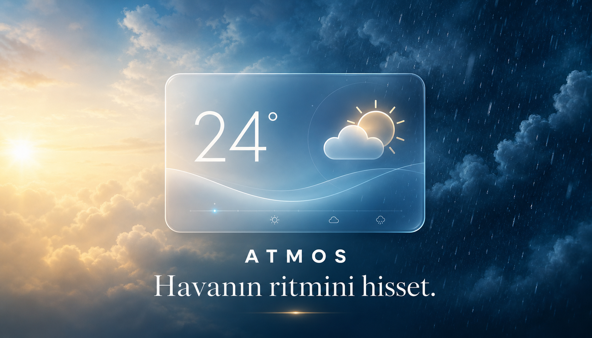
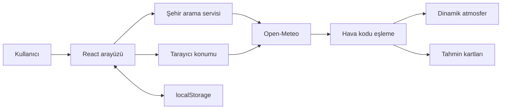

<div align="center">



# Atmos Weather

### Havanın ritmini hisset.

Hava koşullarına göre görünümü ve hareketleri tamamen değişen, modern ve atmosferik bir hava durumu deneyimi.

[](https://react.dev/)
[](https://www.typescriptlang.org/)
[](https://vite.dev/)
[](https://motion.dev/)
[](https://tailwindcss.com/)
[](https://open-meteo.com/)

[Canlı demoyu aç](https://atmos-weather-istanbul.mhmmdyrk4434.chatgpt.site) · [Hata bildir](../../issues) · [Özellik öner](../../issues/new)

</div>

---

## Proje hakkında

Atmos, klasik bir hava durumu tablosu yerine kullanıcının bulunduğu şehrin havasını görsel bir deneyime dönüştürür. Arka plan renkleri, parçacıklar, ışıklar, bulutlar ve geçiş animasyonları Open‑Meteo API'sinden gelen gerçek hava kodlarına göre değişir.

Uygulama yalnızca hava verisini göstermekle kalmaz; saatlik tahmin seçildiğinde gelecekteki havayı sahneye taşır, şehir değişimlerini akıcı animasyonlarla sunar ve hava koşuluna uygun kısa öneriler verir.

## Öne çıkan özellikler

- **Dinamik atmosfer:** Açık, bulutlu, yağmurlu, karlı, fırtınalı, sisli ve gece sahneleri.
- **Gerçek zamanlı yağmur:** Canvas tabanlı, rüzgâr yönüne ve hızına tepki veren performanslı parçacık sistemi.
- **Akıcı geçişler:** Motion ile şehir, sıcaklık, hava teması ve kart giriş animasyonları.
- **Premium arayüz:** Glassmorphism yüzeyler ve React Bits yaklaşımından uyarlanan Spotlight kartları.
- **Akıllı şehir arama:** Yazarken öneriler, klavye ile seçim, yükleme ve kullanıcı dostu hata durumları.
- **Konum desteği:** Kullanıcı izin verdiğinde tarayıcı konumundan anlık hava durumu.
- **Favoriler:** Seçilen şehirler ve son konum cihazda `localStorage` ile saklanır.
- **Saatlik tahmin:** Yatay kaydırılabilir 12 saatlik hava kartları.
- **7 günlük tahmin:** Responsive grid, yağış ihtimali, sıcaklık aralığı, rüzgâr ve UV detayları.
- **Detay metrikleri:** Nem, rüzgâr, basınç, görüş mesafesi, gün doğumu ve gün batımı.
- **Tema sistemi:** Otomatik, aydınlık ve karanlık görünüm.
- **Erişilebilir hareket:** `prefers-reduced-motion` tercihine saygı gösterir.
- **Responsive tasarım:** Mobil, tablet ve masaüstünde uyarlanmış yerleşim.
- **API anahtarı gerektirmez:** Open‑Meteo ücretsiz uç noktaları kullanılır.

## Hava sahneleri

| Hava durumu | Görsel tema | Animasyon |
|---|---|---|
| ☀️ Açık | Mavi, sarı ve sıcak ışık | Dönen güneş ışınları, yumuşak parlama |
| ☁️ Bulutlu | Gri ve mavi tonlar | Rüzgâr hızına bağlı hareket eden bulutlar |
| 🌧️ Yağmurlu | Koyu lacivert | Bağımsız hız ve derinliğe sahip Canvas damlaları |
| ❄️ Karlı | Buz mavisi ve beyaz | Salınımlı kar parçacıkları |
| ⛈️ Fırtınalı | Mor ve koyu lacivert | Yağmur ve aralıklı şimşek parlamaları |
| 🌫️ Sisli | Düşük kontrastlı gri-mavi | Yavaş kayan bulanık sis katmanları |
| 🌙 Gece | Lacivert ve mor | Ay, yıldızlar ve hafif parıltılar |

## Ekranlar ve veriler

### Ana hava durumu

- Şehir ve ülke
- Mevcut ve hissedilen sıcaklık
- Hava açıklaması
- Günün en yüksek sıcaklığı
- Nem, rüzgâr, basınç ve görüş mesafesi
- Gün doğumu ve gün batımı
- Hava koşuluna göre kısa öneri

### Saatlik ve haftalık tahmin

Saatlik kartlardan biri seçildiğinde ana sıcaklık, hava açıklaması ve atmosfer seçilen saate geçer. Yedi günlük kartlar küçük ekranlarda iki sütuna, geniş ekranlarda yedi sütuna kadar uyarlanır.

## Teknoloji yığını

| Teknoloji | Kullanım amacı |
|---|---|
| React 19 | Bileşen tabanlı kullanıcı arayüzü |
| TypeScript | Tip güvenliği ve daha sağlam veri modeli |
| Vite + Vinext | Geliştirme, derleme ve Cloudflare uyumlu çıktı |
| Tailwind CSS 4 | Tasarım altyapısı ve CSS işleme |
| Motion for React | Giriş, çıkış, liste ve tema animasyonları |
| React Bits yaklaşımı | Spotlight etkileşimli cam kart yüzeyleri |
| Lucide React | Tutarlı ve erişilebilir ikon sistemi |
| Open‑Meteo | Hava tahmini ve şehir arama API'leri |
| Canvas API | Performanslı yağmur parçacıkları |
| localStorage | Favori şehir, son şehir ve tema tercihi |

## Mimari



Uygulama için bir backend veya veritabanı gerekmez. Hava ve şehir arama verileri doğrudan Open‑Meteo'dan alınır; kullanıcı tercihleri yalnızca kendi cihazında tutulur.

## Proje yapısı

```text
weather-app/
├── app/
│   ├── globals.css          # Tema, responsive tasarım ve atmosfer efektleri
│   ├── layout.tsx           # Metadata, ikonlar ve sosyal paylaşım ayarları
│   ├── page.tsx             # Ana sayfa girişi
│   └── weather-app.tsx      # API, durum yönetimi ve tüm hava arayüzü
├── public/
│   ├── favicon.svg
│   ├── og.png
│   └── og-v2.png            # Güncel sosyal paylaşım görseli
├── tests/                   # Derleme ve HTML kontrolleri
├── worker/                  # Cloudflare Worker girişi
├── .openai/hosting.json     # Sites yayın yapılandırması
├── package.json
├── vite.config.ts
└── tsconfig.json
```

## Yerel kurulum

### Gereksinimler

- Node.js `22.13.0` veya üzeri
- npm
- Git

### Adımlar

```bash
git clone <REPOSITORY-URL>
cd <REPOSITORY-KLASORU>
npm install
npm run dev
```

Geliştirme sunucusu varsayılan olarak aşağıdaki adreste açılır:

```text
http://localhost:3000
```

Windows PowerShell yürütme politikası nedeniyle `npm run dev` çalışmazsa:

```powershell
$env:WRANGLER_LOG_PATH='.wrangler/wrangler.log'
.\node_modules\.bin\vinext.cmd dev
```

## Kullanılabilir komutlar

| Komut | Açıklama |
|---|---|
| `npm run dev` | Yerel geliştirme sunucusunu başlatır |
| `npm run build` | Üretim derlemesini oluşturur |
| `npm run start` | Üretim sunucusunu çalıştırır |
| `npm run lint` | Kod kalite kontrollerini çalıştırır |
| `npm test` | Derleme ve HTML kontrollerini çalıştırır |

## Open‑Meteo entegrasyonu

Atmos iki ayrı Open‑Meteo servisini kullanır:

```text
https://api.open-meteo.com/v1/forecast
https://geocoding-api.open-meteo.com/v1/search
```

Alınan başlıca değerler:

- Sıcaklık ve hissedilen sıcaklık
- Bağıl nem
- Yağış ve yağış ihtimali
- WMO hava kodu
- Rüzgâr hızı ve yönü
- Deniz seviyesi basıncı
- Görüş mesafesi
- UV indeksi
- Gün doğumu ve gün batımı
- Saatlik ve günlük tahminler

API anahtarı kullanılmadığı için repoya gizli anahtar eklemek gerekmez.

## Hava kodu eşleme

```ts
0            → clear
1, 2, 3      → cloudy
45, 48       → fog
51–67, 80–82 → rain
71–77, 85–86 → snow
95–99        → storm
```

Seçilen saat gece aralığındaysa hava kodundan bağımsız olarak gece sahnesi etkinleştirilir. Gün doğumu ve gün batımına yakın saatlerde alacakaranlık renkleri kullanılır.

## Gizlilik

- Konum bilgisi yalnızca kullanıcı açıkça izin verdiğinde tarayıcıdan alınır.
- Koordinatlar bir uygulama veritabanına kaydedilmez.
- Favoriler, tema ve son şehir yalnızca tarayıcı `localStorage` alanında tutulur.
- Uygulamada kullanıcı hesabı veya takip sistemi bulunmaz.

## Yayınlama

Projenin çalışan özel sürümü Sites üzerinde yayınlanmaktadır:

**[atmos-weather-istanbul.mhmmdyrk4434.chatgpt.site](https://atmos-weather-istanbul.mhmmdyrk4434.chatgpt.site)**

GitHub Pages üzerinde yayınlamak için uygulamanın standart statik Vite çıktısına uyarlanması ve GitHub Actions workflow'u eklenmesi gerekir. Repository adı alt dizin olarak kullanılacaksa Vite `base` değeri `/<REPO-ADI>/` olmalıdır.

## Yol haritası

- [x] Canlı hava durumu verileri
- [x] Şehir arama ve klavye navigasyonu
- [x] Tarayıcı konumu
- [x] Saatlik ve yedi günlük tahmin
- [x] Dinamik hava sahneleri
- [x] Canvas yağmur sistemi
- [x] Motion geçişleri
- [x] Favoriler ve tema sistemi
- [x] Responsive tasarım
- [x] Azaltılmış hareket desteği
- [ ] Sıcaklık ve yağış grafikleri
- [ ] PWA ve çevrimdışı son veri desteği
- [ ] Birim seçimi: °C/°F ve km/h/mph
- [ ] Otomatik test kapsamının genişletilmesi
- [ ] GitHub Pages statik dağıtım workflow'u

## Katkıda bulunma

1. Projeyi fork edin.
2. Yeni bir branch oluşturun: `git checkout -b feature/yeni-ozellik`
3. Değişikliklerinizi kaydedin: `git commit -m "feat: yeni özellik ekle"`
4. Branch'i gönderin: `git push origin feature/yeni-ozellik`
5. Pull Request açın.

Hata bildirirken tarayıcı, ekran boyutu, seçilen şehir ve hava koşulu bilgisini eklemek sorunun yeniden üretilmesini kolaylaştırır.

## Lisans

Bu repository için henüz bir açık kaynak lisansı tanımlanmamıştır. Kullanım ve dağıtım koşulları için proje sahibine danışın.

## Teşekkürler

- Hava ve şehir arama verileri için [Open‑Meteo](https://open-meteo.com/)
- Animasyon altyapısı için [Motion](https://motion.dev/)
- Arayüz ilhamı için [React Bits](https://github.com/DavidHDev/react-bits)
- İkonlar için [Lucide](https://lucide.dev/)

---

<div align="center">

**Atmos Weather** · Havanın ritmini hisset.

</div>
